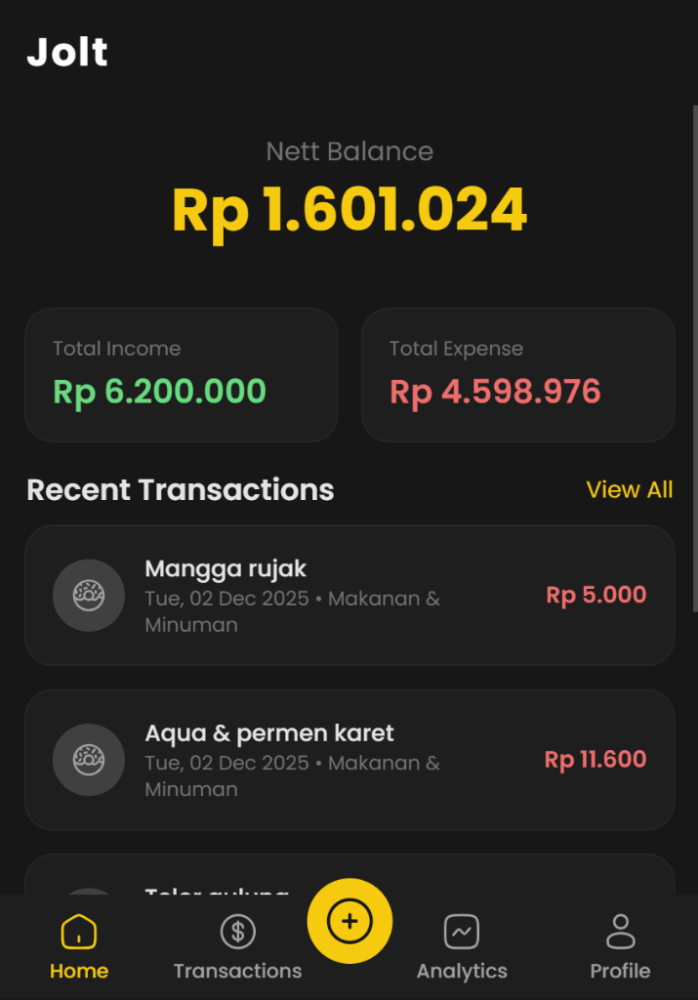

# Jolt ⚡

[](https://ui.nuxt.com)
[](https://nuxt.com)
[](https://www.typescriptlang.org)
[](https://t.me/jollexpenser_bot)
[](LICENSE)

**Jolt** is an AI-powered personal finance management application that combines the convenience of a **Telegram bot** with a beautiful **web dashboard**. Track your expenses naturally through chat, and visualize your financial data with powerful analytics.

<p align="center">
  
</p>

---

## ✨ Features

### 🤖 AI-Powered Transaction Tracking
- **Natural Language Processing** – Send messages like *"Spent $25 on lunch"* or *"Received salary $3000"*
- **Smart Categorization** – AI automatically categorizes your transactions
- **Context-Aware** – Extracts amount, category, date, and notes intelligently

### 📊 Comprehensive Analytics
- **Daily Trends** – Interactive charts showing spending patterns over time
- **Category Breakdown** – Visualize where your money goes with pie/donut charts
- **Monthly Comparisons** – Track income vs. expenses month over month
- **AI Insights** – Get intelligent recommendations based on your spending habits

### 📱 Mobile-First Dashboard
- **Responsive Design** – Works seamlessly on desktop, tablet, and mobile
- **Dark/Light Mode** – Choose your preferred theme
- **Bottom Navigation** – Intuitive mobile navigation experience
- **Real-time Updates** – Instant sync with your Telegram transactions

### 🏷️ Category Management
- **Custom Categories** – Create and manage your own categories with icons
- **Visual Icons** – Browse and select from hundreds of icons
- **Flexible Organization** – Group transactions your way

---

## 🏗️ Architecture

```
┌─────────────────┐      ┌─────────────────┐      ┌─────────────────┐
│  Telegram Bot   │ ───▶ │  n8n Workflow   │ ───▶ │  Web Dashboard  │
│  (Primary UI)   │      │  (AI Engine)    │      │  (This Repo)    │
└─────────────────┘      └─────────────────┘      └─────────────────┘
         │                        │                         │
         └────────────────────────┴─────────────────────────┘
                                  │
                          ┌───────▼────────┐
                          │   PostgreSQL   │
                          │    (Neon)      │
                          └────────────────┘
```

### Components

| Component | Description |
|-----------|-------------|
| **Telegram Bot** | Primary user interface for logging transactions via natural language |
| **n8n Workflow** | AI processing pipeline that extracts structured data from messages |
| **Web Dashboard** | Full-featured analytics and transaction management (this repository) |
| **PostgreSQL** | Serverless database powered by Neon |

---

## 🛠️ Tech Stack

### Frontend
| Technology | Purpose |
|------------|---------|
| [Nuxt 4](https://nuxt.com) | Full-stack Vue framework |
| [Nuxt UI 4](https://ui.nuxt.com) | Component library with Tailwind CSS v4 |
| [Unovis](https://unovis.dev) | Data visualization library |
| [VueUse](https://vueuse.org) | Vue composition utilities |
| [Iconify](https://iconify.design) | Icon framework (Lucide, Solar, Simple Icons) |

### Backend
| Technology | Purpose |
|------------|---------|
| [Nitro](https://nitro.unjs.io) | Server engine (built into Nuxt) |
| [Drizzle ORM](https://orm.drizzle.team) | Type-safe database ORM |
| [Zod](https://zod.dev) & [Valibot](https://valibot.dev) | Schema validation |
| [nuxt-auth-utils](https://github.com/atinux/nuxt-auth-utils) | Telegram authentication |
| [AI SDK](https://sdk.vercel.ai) | AI/LLM integration |

### Infrastructure
| Technology | Purpose |
|------------|---------|
| [Neon](https://neon.tech) | Serverless PostgreSQL |
| [Docker](https://docker.com) | Containerization |
| [Bun](https://bun.sh) | JavaScript runtime & package manager |

---

## 📁 Project Structure

```
jolt/
├── app/                          # Frontend application
│   ├── pages/                    # Route pages
│   │   ├── index.vue             # Dashboard home
│   │   ├── transactions.vue      # Transaction list
│   │   ├── analytics.vue         # Charts and insights
│   │   ├── categories.vue        # Category management
│   │   └── profile.vue           # User profile
│   ├── components/               # Vue components
│   │   ├── analytic/             # Chart components
│   │   │   ├── AIInsights.vue    # AI-powered insights
│   │   │   ├── DailyChart.vue    # Daily spending chart
│   │   │   ├── CategoryChart.vue # Category breakdown
│   │   │   └── MonthlyChart.vue  # Monthly comparison
│   │   ├── TransactionCard.vue   # Transaction display
│   │   ├── CategoryModal.vue     # Category editor
│   │   └── IconPicker.vue        # Icon selection
│   └── layouts/                  # Page layouts
│
├── server/                       # Backend API
│   ├── api/
│   │   ├── transactions/         # Transaction CRUD
│   │   ├── analytics/            # Analytics endpoints
│   │   ├── categories/           # Category management
│   │   └── auth/                 # Authentication
│   ├── db/                       # Database schema
│   ├── services/                 # Business logic
│   └── middleware/               # Auth & validation
│
├── shared/                       # Shared types & utilities
│   └── types/                    # TypeScript definitions
│
└── docs/                         # Documentation
```

---

## � Getting Started

### Prerequisites

- [Bun](https://bun.sh) (recommended) or Node.js 20+
- PostgreSQL database ([Neon](https://neon.tech) recommended)
- Telegram Bot Token (for authentication)

### Installation

1. **Clone the repository**
   ```bash
   git clone https://github.com/yourusername/jolt.git
   cd jolt
   ```

2. **Install dependencies**
   ```bash
   bun install
   ```

3. **Set up environment variables**
   ```bash
   cp .env.example .env
   ```
   
   Configure the following variables in `.env`:
   ```env
   DATABASE_URL=your_neon_database_url
   NUXT_SESSION_PASSWORD=your_session_secret_min_32_chars
   NUXT_OAUTH_TELEGRAM_BOT_TOKEN=your_telegram_bot_token
   NUXT_OPENAI_API_KEY=your_openai_api_key
   ```

4. **Run database migrations**
   ```bash
   bun run db:migrate
   ```

5. **Start the development server**
   ```bash
   bun dev
   ```

   The app will be available at `http://localhost:3000`

---

## 📜 Available Scripts

| Script | Description |
|--------|-------------|
| `bun dev` | Start development server |
| `bun build` | Build for production |
| `bun preview` | Preview production build |
| `bun lint` | Run ESLint |
| `bun lint:fix` | Fix ESLint issues |
| `bun typecheck` | Run TypeScript type checking |
| `bun run db:generate` | Generate Drizzle migrations |
| `bun run db:migrate` | Run database migrations |
| `bun run docker:build` | Build Docker image |
| `bun run docker:push` | Push Docker image |

---

## 🔌 API Reference

### Transactions

| Method | Endpoint | Description |
|--------|----------|-------------|
| `GET` | `/api/transactions` | List transactions (paginated) |
| `GET` | `/api/transactions/:id` | Get single transaction |
| `POST` | `/api/transactions` | Create transaction |
| `PUT` | `/api/transactions/:id` | Update transaction |
| `DELETE` | `/api/transactions/:id` | Delete transaction |

### Analytics

| Method | Endpoint | Description |
|--------|----------|-------------|
| `GET` | `/api/analytics/summary` | Overall financial summary |
| `GET` | `/api/analytics/daily` | Daily spending data |
| `GET` | `/api/analytics/categories-breakdown` | Category-wise breakdown |
| `GET` | `/api/analytics/insights` | AI-powered insights |

### Categories

| Method | Endpoint | Description |
|--------|----------|-------------|
| `GET` | `/api/categories` | List user categories |
| `POST` | `/api/categories` | Create category |
| `PUT` | `/api/categories/:id` | Update category |
| `DELETE` | `/api/categories/:id` | Delete category |
| `GET` | `/api/master/categories` | List default categories |

---

## 🐳 Docker Deployment

Build and run with Docker:

```bash
# Build the image
bun run docker:build

# Run with Docker Compose
docker compose up -d
```

Or use the pre-built image:

```yaml
# compose.yaml
services:
  jolt:
    image: jolleyx/jolt:latest
    ports:
      - "3000:3000"
    environment:
      - DATABASE_URL=${DATABASE_URL}
      - NUXT_SESSION_PASSWORD=${NUXT_SESSION_PASSWORD}
      - NUXT_OAUTH_TELEGRAM_BOT_TOKEN=${NUXT_OAUTH_TELEGRAM_BOT_TOKEN}
```

---

## 🔒 Security

- **Telegram Authentication** – No passwords, secure OAuth via Telegram
- **Session Management** – Encrypted session tokens with nuxt-auth-utils
- **Environment Variables** – Sensitive config never committed to source
- **Protected Routes** – Server middleware validates authentication

---

## 🎯 Roadmap

- [ ] Budget planning and alerts
- [ ] Recurring transactions
- [ ] Multi-currency support
- [ ] Export to CSV/Excel
- [ ] Shared household budgets
- [ ] Receipt image scanning

---

## 🤝 Contributing

Contributions are welcome! Please feel free to submit a Pull Request.

1. Fork the repository
2. Create your feature branch (`git checkout -b feature/amazing-feature`)
3. Commit your changes (`git commit -m 'Add some amazing feature'`)
4. Push to the branch (`git push origin feature/amazing-feature`)
5. Open a Pull Request

---

## 📄 License

This project is licensed under the MIT License – see the [LICENSE](LICENSE) file for details.

---

## 💬 Support

- 🐛 **Bug Reports**: [Open an issue](https://github.com/yourusername/jolt/issues)
- 🤖 **Try the Bot**: [t.me/jollexpenser_bot](https://t.me/jollexpenser_bot)
- 💡 **Feature Requests**: [Start a discussion](https://github.com/yourusername/jolt/discussions)

---

<p align="center">
  Made with ❤️ and ☕
</p>
